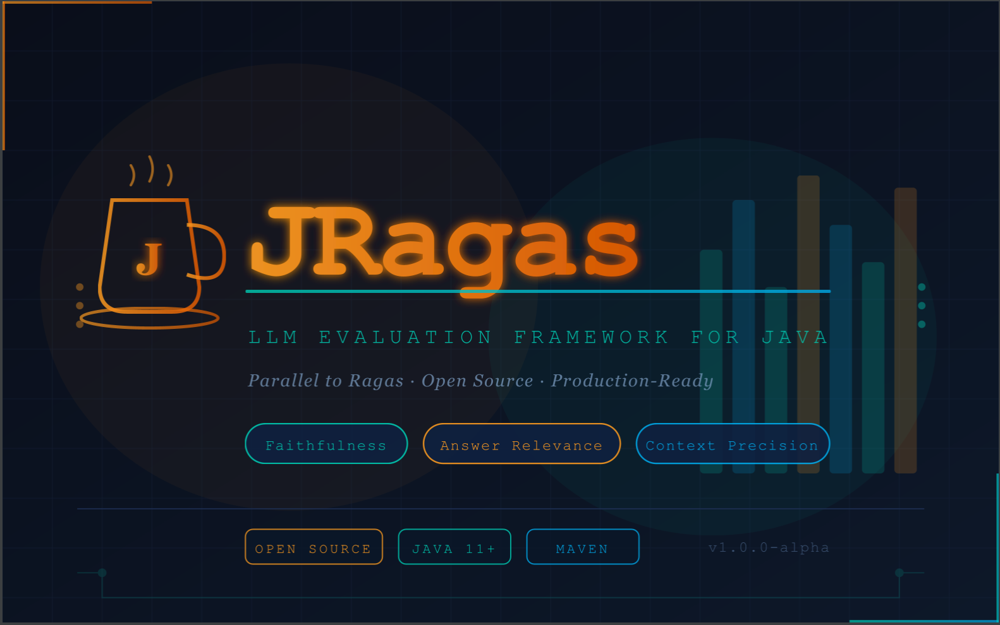

<h1 align="center">
  
</h1>
<p align="center">
  <i>Supercharge Your LLM Application Evaluations</i>
</p>

<h4 align="center">
  <p>
    <a href="./docs/index.md">Documentation</a> |
    <a href="./docs/getstarted/quickstart.md">Quick start</a> |
    <a href="./docs/howtos/api.md">API</a> |
    <a href="./docs/howtos/cli.md">CLI</a> |
    <a href="">Join Discord</a>
  <p>
</h4>

Objective metrics, intelligent test generation, and data-driven insights for LLM apps.

This repository is the Java/Spring Boot migration of Ragas. It focuses on the core evaluation engine, dataset schema validation, default metrics, an OpenAI-first adapter module, and a Spring Boot API + CLI.

## Key Features

- Objective metrics for single-turn evaluation (token-based parity for MVP metrics).
- Core evaluation orchestration with synchronous and asynchronous runs.
- Dataset schema validation and required-column enforcement.
- Spring Boot API with trace ID propagation and structured error responses.
- CLI to submit evaluation runs and query run status.
- R2R dataset transformation endpoint for integrations.

## Installation

Prerequisites:

- Java 21
- Maven 3.9+

From source:

```bash
mvn clean verify
```

## Quickstart

### 1) Run the API

```bash
mvn -pl ragas-api -am spring-boot:run
```

### 2) Submit an evaluation

Create `request.json`:

```json
{
  "datasetRows": [
    {
      "user_input": "What is the capital of France?",
      "response": "Paris is the capital of France.",
      "retrieved_contexts": ["France's capital city is Paris."],
      "reference_contexts": ["Paris is the capital and most populous city of France."],
      "reference": "Paris"
    }
  ],
  "metrics": ["answer_relevancy", "faithfulness", "context_precision", "context_recall"],
  "batchSize": 10,
  "rowTimeoutMs": 30000,
  "maxWorkers": 4
}
```

Call the API:

```bash
curl -sS -X POST http://localhost:8080/api/v1/evaluate \
  -H 'Content-Type: application/json' \
  -d @request.json
```

### 3) Use the CLI

```bash
mvn -pl ragas-cli -am exec:java \
  -Dexec.mainClass=io.ragas.cli.RagasCli \
  -Dexec.args="evaluate-sync --request-file request.json"
```

## Modules

- `ragas-domain`: Dataset schema and sample types.
- `ragas-core`: Evaluation orchestration and validation.
- `ragas-metrics`: Default metric implementations.
- `ragas-llm-adapters`: OpenAI HTTP client and adapter building blocks.
- `ragas-embedding-adapters`: Embedding adapter scaffolding.
- `ragas-integrations`: Integration helpers (R2R transform, tracing sinks).
- `ragas-api`: Spring Boot API.
- `ragas-cli`: Picocli-based CLI.
- `ragas-e2e-tests`: End-to-end contract and integration tests.

## Status and Parity

This Java port is in active development. Current parity focuses on single-turn dataset validation, default metrics, and API/CLI surfaces that mirror the Python quickstart path. See the migration plan in `plan/ragas-java-spring-migration-plan.md` for the current scope and milestones.

## Community

Join the Ragas community on Discord: <Coming soon>

## Contributing

See `CONTRIBUTING.md`.

## Security

See `SECURITY.md`.

## Cite Us

```
@misc{jragas2026,
  author       = {digital-dumbo},
  title        = {JRagas: Supercharge Your LLM Application Evaluations},
  year         = {2026},
  howpublished = {\url{https://github.com/digital-dumbo/jragas}},
}
```
